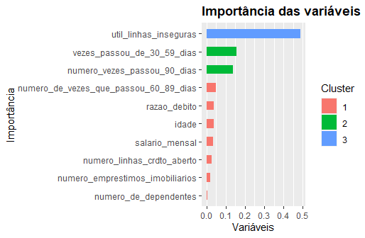

Modelo de Score de Crédito - DataMiner
================

O presente trabalho visa construir um modelo preditivo de score de crédito para inadimplência. 

O arquivo "teste.csv" contém as predições das probabilidades geradas pelo modelo e a classificação - 1 para inadimplente e 0 para não. Uma probabilidade menor do que 0,5 gerará uma predição da classe 0 e uma maior ou igual a 0,5 gerará uma predição de 1. 

O arquivo "Script_DataMiner.R" contém o código utilizado para a análise.

# Análise Descritiva
## Pré-processamento
Uma análise inicial é realizada a fim de se verificar a existência de dados faltantes e a consistência dos dados.

O conjunto de treino total fornecido foi particionado em 80% para treino e 20% para testar a performance do modelo.

O conjunto de treino fornecido apresenta duas variáveis com dados faltantes: "numero_de_dependentes" e "salario_mensal", sendo que esta última tem mais de 20% de dados faltantes.

De acordo com as informações fornecidas, as variáveis preditoras são numéricas e espera-se que assumam valores não-negativos. A análise confirmou tais afirmações. 

A análise não evidenciou nenhum problema de formatação. 

Foi verificado também que o conjunto de treino apresenta 93,32% das classes com o valor 0, o que evidencia um desbalanceamento das classes.

# Modelagem
O modelo escolhido será o XGBoost com pesos escalados, por apresentar bons resultados para conjunto de dados com grande quantidade de ddados faltantes e com classes desbalanceadas.

A métrica utilizada para treino do modelo foi a auc, já que a acurácia, a mais usada em modelos de classificação, não é muito adequada para classes desbalanceadas. A especificidade e a acurácia balanceada serão analisadas no resultado do conjunto de teste, pois permitem analisar o quanto o modelo está classificando bem a classe minoritária, que no caso é a classe "1", já que é muito importante classificar corretamente um pedido de crédito que será inadimplente.

# Resultados
Em uma análise de 30 iterações, o modelo gerado ela 14ª iteração apresentou o maior auc, mas o modelo gerado pela 16ª iteração foi escolhido, pois apresentou uma especificidade semelhante no conjunto de cross-validation utilizado pelo modelo, mantendo uma acurácia balanceada melhor.

No conjunto de teste, a especificidade resultante foi de 0,7367 e a acurácia balanceada foi de 0,7707. A matriz de confusão para esse conjunto foi de:

```
              Valores              
Preditos    0     1
0         16534  382
1         4015   1069   
```

O gráfico abaixo mostra o grau de importância das variáveis pelo ganho de informação. Percebe-se que a variável "util_linhas_inseguras" responde por quase metade do ganho de informação do modelo.

